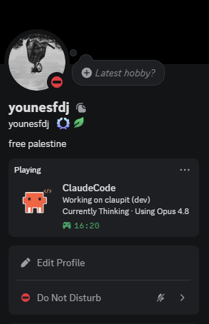

<div align="center">
  
  <h1>
    Vibecoder Discord Presence
  </h1>
  <p><strong>Your AI coding sessions, live on Discord.</strong></p>


</div>

A live Discord status for your AI coding sessions — thinking, editing, running
tests, as it happens. Theme it however you like (or build your own from scratch),
and it stays private unless you choose to share more.

## Supported tools

| Tool        | Status       |
| ----------- | ------------ |
| Claude Code | ✅ supported |
| Gemini CLI  | 🔜 planned   |
| Codex       | 🔜 planned   |
| OpenCode    | 🔜 planned   |

> Built on a provider model — adding a tool only changes how events are read, not
> the rest. PRs welcome.

## Install

```sh
npm i -g vibecoder-discord-presence
```

## Setup

```sh
vdp install
```

Open your AI coding tool with the Discord **desktop** app running — your status
shows up on its own. That's the whole setup.

> Needs Node 18+ and the Discord desktop app.

## Themes

Five built-ins, from privacy-safe to maximum vibes.

<p align="center">
  
</p>

`minimal` · `developer` · `focus` · `playful` · `chaos`

## Customize

```sh
vdp config
```

Pick a theme or build your own — every line, image, and button — with a live
preview as you go.

## Commands

| Command                    | What it does                                   |
| -------------------------- | ---------------------------------------------- |
| `vdp install`              | Set it up                                      |
| `vdp config`               | Customize the card                             |
| `vdp status`               | See what's running                             |
| `vdp stop` / `vdp restart` | Control the background process                 |
| `vdp uninstall [--purge]`  | Remove it (`--purge` also deletes your config) |

## Privacy

The default `minimal` theme shares nothing about your work — no project names,
paths, or filenames. Anything more is opt-in, and there's no telemetry.

## How it works

A small hook fires on each event and writes a marker file. A lightweight
background process reads it, updates Discord, and exits once you're idle — no
always-on daemon, no manual start/stop.

## License

[MIT](LICENSE) © [younesfdj](https://github.com/younesfdj)
